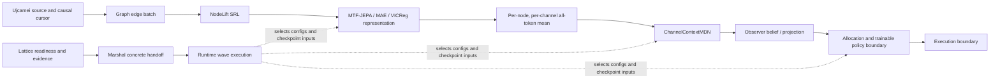

# Cuwacunu project state

Snapshot: 2026-08-28
Purpose: restore a shared, human-readable view of the architecture, model-learning evidence, and current decision boundary.

This is a navigation document, not a replacement for Runtime manifests or
protocol contracts. It was initially reconstructed from tracked source,
configuration, reports, and verified development records without running a
job. Subsequent Project Clear Signal development-only diagnostics are recorded
below. No certified/final range or policy data has been opened by this recovery.

## Executive state

- The configured production protocol is **`cwu_02v`**. It selects **MTF-JEPA-MAE-VICReg** as the active representation and **ChannelContextMDN** as the forecast model.
- The Synthetic Continuous Graph V2 data is strongly sequential and forecastable. An order-24 linear ridge is essentially perfect, and the production MDN family learns it well when given causal raw history.
- The full learned representation-to-MDN forecast remains near chance on the simple V2 task.
- The representation is **not literally random or collapsed**. Frozen affine probes recover moderate signal, but canonical representation training has not clearly improved the served surface over initialization.
- A new exact-architecture, module-only three-seed screen confirms that the
  active objective reduces clean sequence-probe sample efficiency and
  concentrates the served covariance geometry. Paired objective attribution
  localizes the incremental AULC loss to both TF alignment and global VICReg.
  TF alignment improves rank geometry despite hurting AULC; global VICReg is
  the dominant incremental rank-collapse pressure because it regularizes a
  projected global all-channel mean while serving uses separate per-channel
  pools. JEPA/MAE-only is least harmful by AULC but remains unqualified. The
  preregistered follow-up then rejected both gradient-matched TF warmup and
  projected channel-stratified VICReg: each failed its rescue,
  noninferiority, and geometry gates under valid mechanics, so their combined
  arm and longer trajectories were not authorized. A separately frozen
  variance-component screen then found that disabling only the stratified
  variance term erased essentially all of its fixed-seed AULC and geometry
  damage and returned almost exactly to JEPA/MAE. Its formal necessity gate
  still failed because the paired held-out-group rescue interval crossed zero,
  so this is strong trajectory-localization evidence, not a supported
  necessity claim or a repair. The full launcher augmentation profile also
  fails an isolated causal-semantic qualifier. A matched three-arm training
  screen then confirmed its support and terminal-anchor damage but found no
  material clean representation effect: the semantically qualified subset
  tracked neutral and failed both improvement gates. Outer augmentation is
  therefore a production-safety defect, not the supported explanation for the
  remaining JEPA/MAE representation deficit. None of these diagnostics changed
  production configuration or consumed certified/final data.
- A same-checkpoint serving-pool replay falsified simple time/frequency token
  dilution as a sufficient cause. A follow-up channel-conditioned affine probe
  recovered substantially more signal, proving that the old shared-channel
  readout hid part of the representation's value, but still missed the strong
  gate. A coordinate-matched nonlinear control then learned raw NodeLift
  history in 3/3 seeds but underfit the frozen representation in 3/3. Later
  controls proved that the better affine map is inside the MLP class, while
  the fixed Adam schedule both fails to acquire it and destroys an exact warm
  start. Freezing that affine map outside the optimizer preserves it, but a
  zero-output nonlinear residual adds no material value. Finally, all seven
  compatible sealed raw-96 surfaces were re-evaluated with the corrected
  edge-by-channel affine readout; every arm improved past the old shared-head
  view, but none passed the original strong gate. This left **pre-pool token
  information versus loss/distortion in the served mean** as the next
  unresolved boundary, not another optimizer or already-sealed pooling variant.
- RSSM-1 has now resolved that module boundary under its frozen no-training
  sequence-accessibility test. Raw, tokenizer, and encoder-token surfaces retain
  similar fixed-96 AULC, while the current per-channel `all_tokens` mean is the
  first material-loss boundary in both native and equal-width tracks. The
  reversal probe independently falls from order-decodable at encoder tokens to
  unresolved after serving. The audited terminal classification is
  `serving_pooling_loss`. This does not contradict the earlier pool replay:
  simple time/frequency selection still failed the downstream strong gate, so
  RSSM supports a structure-preserving pooling investigation, not a switch to
  an already-tested policy. No production or follow-on repair is authorized.
- SRR-1 then established that a channel/domain/scale-structured readout
  preserves useful sequence information that `all_tokens` averaging destroys;
  SRR-2 proved exact parity between that accepted shadow and the opt-in
  production `structured_cdsb_v1` selector. SRR-3 has now stopped activation
  at the next boundary: on the frozen graph-first historical surface,
  `all_tokens` marks all 3,936 anchor/node/channel positions valid, while
  `structured_cdsb_v1` marks only 1,312 valid. Channels 0 and 1 are masked and
  zeroed for every retained row; only channel 2 survives. Shape, finiteness,
  zeroing, source order, and frozen-state mechanics pass, but coverage parity
  fails before any MDN forward or endpoint metric. The terminal decision is
  `downstream_bottleneck_remains_unresolved`; Stage B head adaptation was not
  authorized, `all_tokens` remains the rollback, and the next prerequisite is
  a separately versioned sparse/partial-mask structured readout contract.
  Augmentation attribution remains deferred.
- SRR-4 has now supplied and qualified that separate contract as the opt-in
  `structured_cdsb_sparse_v1` policy. On the actual H4/H10/H30 graph-first
  surface it restores exact coverage parity with `all_tokens` (`3936/3936`
  confirmation cells), while complete H30 rows remain byte-identical to the
  accepted v1 path. In the frozen equal-compute representation probe,
  confirmation direction improves from `0.7449` to `0.7961`, pairwise rank
  from `0.7236` to `0.7612`, and RMSE falls by about `6.9%` (ratio `0.9313`);
  all paired confidence bounds and all three materiality flags pass. The
  terminal decision is `sparse_structured_repair_qualified`. This authorizes
  a fresh SRR-3 Stage A against the frozen MDN head; it does not activate the
  policy, open the MDN, authorize head training yet, or begin augmentation
  attribution. `all_tokens` remains active and the rollback.
- SRR-3R has now completed that fresh frozen-head gate. The sparse and legacy
  contexts both retain full `3936/3936` coverage, the historical `all_tokens`
  MDN checkpoint loads once and safely consumes both arms, and all
  noninferiority mechanics pass. But the head realizes none of SRR-4's
  representation gain: direction, pairwise rank, and best-asset decisions are
  exactly unchanged; RMSE ratio is `0.9999923`; correlation changes by only
  `+0.0000049`; and zero of four material flags pass. The classification is
  `compatible_no_downstream_gain` and the terminal decision remains
  `downstream_bottleneck_remains_unresolved`. Stage B was correctly not
  authorized, no checkpoint migration or activation is supported, and
  `all_tokens` remains active/rollback. The next cost-conscious boundary is a
  zero-training frozen-head signal-transfer localization before any separately
  sealed production-head adaptation gate. Augmentation remains deferred.
- Retry3 completed its development comparison. `time_only` was the best of four weak arms, but every arm failed the representation gates. No certified result was consumed, and there is no valid independent final result.
- The sparse structured readout repair is implemented and
  representation-qualified but has not been activated or promoted. The old
  MDN is mechanically compatible yet functionally insensitive to its useful
  changes, so no downstream-head fix or checkpoint migration has been
  completed; policy behavior remains outside this forecast investigation.

## Authority: what decides the architecture

When prose and code disagree, use this order:

1. A concrete Marshal handoff and its Runtime `job.manifest` decide an actual launch, including checkpoint inputs.
2. `src/config/.config` selects the protocol/config bundle; it currently selects `kikijyeba.protocol.cwu_02v.dsl`.
3. `src/config/kikijyeba.protocol.cwu_02v.dsl` defines the active component families and serving order.
4. Component DSL, NET, and JKIMYEI files define contracts, architecture, and training policy.
5. Tracked benchmark reports and immutable receipts support scientific claims; READMEs and the root audit are explanatory history and may lag.

Important drift:

- `cwu_02v` explicitly makes MTF-JEPA-MAE-VICReg the preferred active representation, while `src/include/wikimyei/README.md` and the MTF DSL still call it experimental and say VICReg is active. The protocol/configuration is authoritative; that prose is stale.
- The canonical MDN DSL still names `vicreg_v1` as its input representation. The MTF Runtime branch substitutes the active MTF assembly ID. This is configuration debt, not proof that the wrong representation is loaded.
- The V2 README still says representation validation has not completed, and the append-only root audit stops at Retry1. Retry3 development completed later and is not yet represented there.
- The default `.config` Runtime wave is currently `policy_training_ppo_v0`. This does not mean that a particular representation or MDN checkpoint is the current production model; normal execution resolves waves and evidence through a concrete handoff.

Primary anchors: `src/config/.config:8,41-42`, `src/config/kikijyeba.protocol.cwu_02v.dsl:5-39`, `src/config/wikimyei.representation.mtf_jepa_mae_vicreg.dsl:4`, `src/config/wikimyei.inference.expected_value.mdn.dsl:11-18`, and `src/include/hero/runtime_hero/runtime/README.md:139`.

## Configured system map

### Model dataflow

| Stage | Actual contract | Important behavior |
|---|---|---|
| Graph batch | observed edge data `[B,L,C,Hx,9]`; future starts at `t+1` | Edge order, masks, graph identity, and causal cursor travel with the batch. |
| NodeLift SRL | observed `[B,L,C,Hx,9]` to node state `[B,C,Hx,N,9]`; future lifted separately | Observed and target-side future are separated. Price features become graph potentials under a component gauge. |
| Node adapter | `[B,C,Hx,N,9]` to `[M=B*N,C,Hx,9]` | Each graph node becomes one representation sample, with indices retained for restoration. |
| MTF representation | `[M,C,Hx,9]` to token latents and pooled channel vectors `[M,C,32]` | MAE and VICReg are training objectives inside this model, not later serving stages. |
| Graph restore | `[M,C,32]` to `[B,N,C,32]` | Restores graph-node order before inference. |
| ChannelContextMDN | context `[B,N,C,32]`, target `[B,N,C,9]` to `log_pi`, `mu`, `sigma` `[B,N,C,9,3]` | Shared slot trunk, channel adapters, and feature-conditioned mixture head. The mixture path has no cross-node or cross-channel attention. |
| Observer/policy | mixture forecast to beliefs, projection, and allocation | Downstream of the model failure being studied; excluded from the V2 isolation. |

Source anchors: `src/include/ujcamei/source/retrieval/dataloader/graph_anchor_edge_batch.h:33-69`, `src/include/wikimyei/expression/nodelift/srl/assembly.h:21-67`, `src/include/wikimyei/representation/encoding/mtf_jepa_mae_vicreg/channel_node_stream_adapter.h:24-121`, `src/include/wikimyei/inference/expected_value/mdn/assembly.h:21-38`, and `src/include/wikimyei/inference/expected_value/mdn/channel_context_mdn.h:186-200`.

### The representation-serving bottleneck

The active representation creates richer ordered tokens than it serves:

- Time tokens summarize windows with masked mean and standard deviation.
- Frequency tokens use centered, Hann-windowed DFT magnitudes; phase is discarded.
- Time and frequency tokens are encoded together.
- `pooled_by_channel` averages **every valid token for a channel**, without preserving time/frequency domain or token order.
- The inference adapter gives the MDN that one 32-value vector per node/channel and synthesizes a singleton sequence dimension. Separate time, frequency, and global pools are discarded.

This is a proven architectural bottleneck. SRR-1/SRR-2 established a
structure-preserving repair on complete module-only blocks; SRR-3 then showed
that its all-24-token validity rule removes sparse H4/H10 channels. SRR-4's
separately versioned `structured_cdsb_sparse_v1` contract now restores all
three channels and passes the frozen sparse-surface representation gate.
SRR-3R then established that the existing MDN is shape/mask/noninferiority
compatible but produces effectively unchanged endpoints from the useful sparse
feature displacement. The active question has therefore moved inside the
downstream head: where the signal is attenuated and what smallest versioned
submodule must be adapted.

Source anchors: `src/include/wikimyei/representation/encoding/mtf_jepa_mae_vicreg/mtf_jepa_mae_vicreg.h:513-544,633-661,890-1062,1119-1126,1749-1768` and `src/include/jkimyei/training/inference/channel_graph_first_inference_launcher.h:1763-1807`.

## Canonical configuration snapshot

| Concern | Current configuration |
|---|---|
| Protocol | `cwu_02v`, graph-first, active |
| Representation | MTF-JEPA-MAE-VICReg; 3 channels; history 30; feature width 9; latent 32 |
| Tokens | time scales `8,16,32,64`; frequency tokens enabled; 16 frequency bins |
| Representation training | 3,000 steps; batch 32; seed 17; JEPA 1.0; MAE 0.25; TF alignment 0.10; global VICReg enabled; channel VICReg disabled; `light_phase_safe_v2` outer view policy |
| MDN | 3 channels; horizon 1; 9 target coordinates; 3 mixtures; hidden width 128; residual depth 2 |
| MDN training | 3,500 steps; batch 64; seed 31; auxiliary direct edge-return readout enabled with strong weighting |
| Serving order | representation, MDN, policy |

Canonical files:

- `src/config/wikimyei.representation.mtf_jepa_mae_vicreg.dsl`
- `src/config/wikimyei.representation.mtf_jepa_mae_vicreg.net`
- `src/config/wikimyei.representation.mtf_jepa_mae_vicreg.jkimyei`
- `src/config/wikimyei.inference.expected_value.mdn.dsl`
- `src/config/wikimyei.inference.expected_value.mdn.net`
- `src/config/wikimyei.inference.expected_value.mdn.jkimyei`

## Checkpoint authority

There is no static production `latest.pt` authority in `.config`. Lattice/Marshal resolves evidence such as `latest_satisfying:*` into concrete checkpoint paths, records them in a handoff, and Runtime records the launch in `job.manifest`. A path called “latest” outside that chain is not enough to identify a production model.

The clean V2 benchmark pins these benchmark-only artifacts:

| Artifact | Path or identity | SHA-256 |
|---|---|---|
| Canonical MTF representation | `.runtime/benchmarks/synthetic_continuous_graph_v2/synthetic_v2_representation_train_isolated_v2/job/channel_representation.report.mtf_jepa_mae_vicreg.pt` | `70919a6f76a1b461d5e46d91a936d2b94ffbc154b44c157e745653e1c460aa6d` |
| Canonical MDN | `.runtime/benchmarks/synthetic_continuous_graph_v2/synthetic_v2_mdn_train_isolated_v2_retry1/job/channel_inference.report.channel_mdn.pt` | `a0a01cf4074aaf96526dfa387677dadfe4a27086eab68063dd13969e5660ab4f` |
| Retry3 selected representation | `time_only`, Retry3-local immutable import of completed Retry2 checkpoint | `f30aef1d8ea1c69ce17b2817e287355cf0d38e77076deaae4acdd560218972ac` |

The `time_only` checkpoint is development benchmark evidence. It has not been promoted into production Runtime/Lattice authority.

Checkpoint safety debt: the MTF archive loader validates dimensions but does not bind the full assembly, token scales, frequency mode, objectives, augmentation, graph, source, or configuration digest. Same-dimensional representation ablations can therefore pass loader validation. Retry scripts compensate with SHA-256 receipts, but that is not a general production identity mechanism.

Source anchors: `src/include/hero/runtime_hero/runtime/job_manifest.h:119`, `src/include/jkimyei/training/representation/mtf_jepa_mae_vicreg_graph_first_launcher.h:1087`, and `src/include/jkimyei/training/inference/channel_graph_first_inference_launcher.h:1844-1898`.

## What the simple-data investigation established

### Strong controls

| Test | Result | Meaning |
|---|---|---|
| V2 lag-1 baseline | direction about 0.940; rank about 0.932 | The next move is strongly sequential. |
| V2 order-24 ridge | direction/rank 1.0; correlation about 1.0; RMSE ratio about 0.0001 | The simple data is readily forecastable from causal history. |
| Production MDN family on raw causal history | direction/rank about 0.98; correlation about 0.995 | The MDN implementation, target plumbing, and optimizer can learn this task when representation is bypassed. |
| Canonical learned representation affine probe | direction 0.759; rank 0.743; correlation 0.717; RMSE ratio 0.698 | Moderate target signal survives; the representation is not random, but it is far below the raw-history ceiling. |
| Clean full learned representation-to-MDN path | near chance | The production learned forecast path still fails on the simple task. |

Tracked reports:

- `src/config/benchmarks/synthetic_continuous_graph_v2/artifacts/synthetic_v2_data_predictability_baselines.v1.report`
- `src/config/benchmarks/synthetic_continuous_graph_v2/artifacts/synthetic_v2_raw_history_supervised_isolation.v1.report`

### Retry3 development comparison

| Representation arm | Direction | Rank | Correlation | RMSE ratio | Status |
|---|---:|---:|---:|---:|---|
| canonical | 0.759 | 0.743 | 0.717 | 0.698 | failed gates |
| endpoint-scale | 0.764 | 0.707 | 0.636 | 0.772 | failed gates |
| time-only | 0.770 | 0.768 | 0.739 | 0.675 | development winner; failed gates |
| no TF alignment | 0.753 | 0.732 | 0.669 | 0.744 | failed gates |

Only these intended representation changes were compared:

- endpoint-scale: final scale `64` changed to `1`;
- time-only: frequency tokens disabled;
- no TF alignment: TF-alignment loss weight `0.10` changed to `0.00`.

At the Retry3 stage, the small `time_only` advantage implicated frequency-
bearing training or pooling without distinguishing them. The later same-
checkpoint serving replay did not reproduce that advantage, and the no-TF
result does not support TF alignment alone as the cause.

All challenger captures reused the canonical MDN checkpoint. Their downstream MDN results therefore measure compatibility with the old head, not the best forecast achievable after training a fair new head for each representation.

### Same-checkpoint serving-pool replay

The development-only Project Clear Signal replay held the canonical checkpoint,
source, NodeLift, target, and encoded token tensor fixed. It derived all four
pools from one encoder pass per anchor and did not construct or execute an MDN.

| Serving pool | Direction | Rank | Correlation | RMSE ratio | Status |
|---|---:|---:|---:|---:|---|
| all tokens | 0.759 | 0.743 | 0.717 | 0.698 | selected by fixed comparator; failed partial and strong gates |
| time tokens | 0.755 | 0.757 | 0.726 | 0.689 | small descriptive tradeoff; failed partial and strong gates |
| frequency tokens | 0.727 | 0.700 | 0.575 | 0.823 | worse; failed partial and strong gates |
| equal time/frequency means | 0.755 | 0.740 | 0.716 | 0.698 | effectively canonical; failed partial and strong gates |

Coordinates and targets were identical across arms, and the new `all_tokens`
train/validation probes were byte-identical to the historical canonical probes.
Therefore the result is `serving_pool_sufficiency_not_established`: simple
domain selection or equal domain weighting cannot recover the missing forecast
quality.

Authoritative receipt:
`.runtime/benchmarks/synthetic_continuous_graph_v2/synthetic_v2_mtf_serving_pool_replay_development_v1/development.status`.

### Channel-conditioned affine localization

Project Clear Signal Phase 2A held the canonical `all_tokens` raw-96 probes,
splits, ridge grid, standardization, comparator, and gates fixed. It changed
only the affine head from one coefficient row per edge shared across all
channels to nine independent edge-by-channel rows.

| Readout | Direction | Rank | Correlation | RMSE ratio | Status |
|---|---:|---:|---:|---:|---|
| shared-channel affine | 0.759 | 0.743 | 0.717 | 0.698 | failed partial and strong gates |
| edge-by-channel affine | 0.894 | 0.871 | 0.872 | 0.491 | passed partial gate; failed strong gate |

The main and replay reports were byte-identical. Channel conditioning is
therefore a real interface defect and explains a large part of the old affine
ceiling, but it is not sufficient to recover the raw-history result. The fixed
Phase 2 contract consequently authorizes the matched nonlinear rung.

Authoritative receipt:
`.runtime/benchmarks/synthetic_continuous_graph_v2/synthetic_v2_frozen_encoder_channel_conditioned_affine_development_v1/development.status`.

### Matched nonlinear V1 terminal-invalid attempt

The first Phase 2B protocol did not produce scientific evidence. Its first
raw-train capture started, then stopped before publishing a probe because the
capture incorrectly required every NodeLift close mask to contain exactly the
configured channel capacity (`4/10/30`) as a contiguous valid suffix. Those
numbers are structural history capacities; actual node validity can be lower
because normalization and graph recoverability are represented by the real
NodeLift mask.

No validation capture or nonlinear evaluator started. Exactly zero probes,
fits, optimizer steps, metrics, or scientific classifications completed. The
attempt is permanently consumed and cannot be resumed or retried under its
protocol identity. Its immutable terminal receipt is
`.runtime/benchmarks/synthetic_continuous_graph_v2/synthetic_v2_matched_nonlinear_sufficiency_development_v1/terminal.invalid.status`
(SHA-256 `a83154f71bee7eda29d3de8e221e55c03b4a42742cdb485a01ebb00ac1f41237`).
A corrected experiment requires a new preregistration, schema, runtime root,
and one-shot attempt.

### Matched nonlinear corrected-control result

Three transparent protocol failures followed the first invalid attempt, and
all remain preserved rather than being overwritten:

- the corrected-control self-test was contaminated by static runtime logging
  before `main`; no scientific input was opened;
- its self-test-report successor stopped after publishing the attempt because
  a Bash `local` initializer expanded an unset variable; no capture or fit
  started;
- the stage-receipt-fix successor completed and validated both captures and
  all six fits, then its redundant outer verifier exceeded an incorrectly
  fixed 30-second administrative timeout. The already-validated result was
  retired instead of being silently accepted.

A separate verification-only protocol subsequently revalidated the complete
sealed bundle without executing a capture, representation, decoder, optimizer,
or model. Its authoritative receipt is:

`.runtime/benchmarks/synthetic_continuous_graph_v2/synthetic_v2_matched_nonlinear_sufficiency_verification_recovery_development_v1/development.status`

Receipt SHA-256:
`cdf50f2a827b0eeb99bb92dca4821dd255b4c0e8d102db7daee759c662d79418`.

The coordinate- and target-matched result is:

| Frozen input to the same 96→128→128→9 MLP | Validation direction | Rank | Correlation | RMSE ratio | Strong seeds |
|---|---:|---:|---:|---:|---:|
| pre-encoder raw NodeLift history | 0.986 | 0.990 | 0.996 | 0.090 | 3/3 |
| trained representation raw-96 | 0.661 | 0.657 | 0.505 | 0.865 | 0/3 |

The representation arm also underfits train (correlation `0.429`, RMSE ratio
`0.903`), so this is not a validation-only generalization collapse. The
authoritative classification is
`information_not_established_at_frozen_raw96_interface`. It proves that the
data, targets, fixed network family, schedule, and optimizer can learn the raw
control while the same bounded training procedure cannot recover comparable
signal from the frozen representation interface. It does **not** yet prove
that the interface has destroyed the information.

The reason for that qualification is now concrete. The edge-by-channel affine
solution already inside the MLP hypothesis class is materially better
(validation correlation `0.872`, RMSE ratio `0.491`), but is extremely
ill-conditioned: selected ridge `1e-12`, coefficient L2 norm `1345.36`.
Regularizing it to ridge `1e-2` shrinks the norm to `0.0766` and degrades it to
correlation `0.413`, RMSE ratio `0.920`—nearly the failed MLP result. The
representation MLP's pre-clipping gradient norms reached `7.58–9.86` against a
clip of `5`; the raw arm stayed below `1.05`. Static audit found no row order,
head routing, target scaling, initialization, or batch-schedule bug.

### Affine-injection and optimizer localization (verified)

The bounded optimizer-localization evaluator completed once with exit code `0`
and wrote a complete 490-line report. Its runner then terminalized during report
validation because it compared ten float32 Torch MSE reductions with separately
recomputed float64 MSE values at absolute tolerance `1e-12`. The observed
differences were only `1.08e-8` to `1.07e-7`; all ten pass the explicit
float32-aware recovery bound
`1.25e-7 + 1.25e-7 * max(abs(a),abs(b))`. The rejected report SHA-256 is
`5b1ebcc7af65792074e653406a1a6f4120dc9ad4105adca5cbca90f6c5815f30`,
and the immutable terminal SHA-256 is
`fd0bcbe4cdda0ac8b77ccd0c30b409704d40a6a7c4cf8fa88108b7e830d395a2`.

Two verification-only recovery identities subsequently failed before producing
authority. V1 reached its cached AWK validator, but the program used the AWK
built-in name `split` as a scalar and failed during parsing. V2 added a
data-free `/dev/null` syntax self-test; that test correctly stopped before an
attempt or report validation because `mawk` rejected line-broken control-flow
expressions. Preflight had only rehashed the frozen lineage artifacts. Their
terminal SHA-256 values are respectively
`660e6c6396828630092243ba1fd569a9b935aa6d2cc46863b3fb3c73b36786db`
and
`eb94e73269eff8e9e7398e8c4377983813479417abb845ed2418f55dfab0daa8`.
Neither recovery executed an evaluator, model, fit, optimizer step, probe read,
or representation forward.

V3 first proved its exact frozen validator against `/dev/null`, then completed
one import-only verification attempt and a separate read-only verification. Its
immutable development receipt SHA-256 is
`ad9be3c76c69bafaa6e42ce63e1e10b05231878f87b465ffd8b56b8156237ad6`.
It executed no evaluator, model, fit, optimizer step, capture, or probe read.
The following measurements are now authoritative development evidence:

- the strict preregistered float64-to-float32 maximum pointwise parity gate
  fails (`0.017214` train, `0.015705` validation versus `0.001`), so the
  report's first-match classification is `float32_conditioning_failure`;
- aggregate direct-float32 forecast quality is nevertheless essentially
  unchanged from float64 (validation correlation `0.87174` versus `0.87168`,
  RMSE ratio `0.49119` versus `0.49130`);
- the analytically injected paired-GELU path matches direct float32 exactly on
  train and validation, ruling out topology, GELU execution, and head routing
  as the acquisition failure; and
- the one seed-31 direct-linear Adam fit clearly fails on train: standardized
  MSE is `6.95x` the oracle and the worst head is `24.92x`; train correlation
  is `0.228` and RMSE ratio `0.974`. Only two of 3,500 steps clipped, so simple
  gradient clipping is not the explanation.

### Affine warm-start stability (complete)

The paired-GELU affine solution was then supplied as the exact step-zero
initialization of the same `96 -> 128 -> 128 -> 9` topology before constructing
Adam. Step-zero train and validation prediction deltas were both exactly zero.
After the one fixed seed-31, 3,500-step schedule, however, Adam had destroyed the
known-good solution: aggregate train standardized MSE was `16.97x` the oracle,
the worst head was `88.87x`, train correlation lost `0.896`, and validation
correlation lost `0.852` relative to the direct-float32 affine route. Every
preservation component failed, and both preregistered clear-stop thresholds
passed. The sealed classification is `optimizer_destabilization_clear_stop`.

The immutable development receipt SHA-256 is
`a2433caac297f39cf02de2f6240605b43a90d77963a246f6366d8acf6c7a3c41`;
the evaluator report SHA-256 is
`80825ab1cf4406dbe04616d6bb2bc1f424d4948ef15a1242b5f59ca068ec5405`.
The result and a separate read-only verification both completed. No encoder,
checkpoint, capture, certified/final input, or policy surface was touched.

### Frozen affine base plus zero-output residual (complete)

The direct-float32 affine prediction was moved entirely outside the optimizer
and checked byte-for-byte after every one of 3,500 steps. A separate
`96 -> 128 -> 128 -> 9` residual branch started with only its output weight and
bias at zero. The residual activated correctly: its first backward pass updated
the output layer, its second pass produced upstream gradients, and the final
upstream parameter delta was nonzero. The affine base remained bit-identical.

The residual nevertheless added no useful signal. Aggregate standardized MSE
was `1.00278x` the base on train and `1.00658x` on validation; the worst head
was `1.01122x` on train and `1.04022x` on validation. All safety/preservation
checks passed, but the fixed 10% train-benefit gate and the original strong gate
failed. The sealed classification is
`frozen_affine_base_residual_inconclusive`; follow-up seeds 47 and 73 are not
authorized. The immutable receipt SHA-256 is
`b3fe1c9f76435aca3c028f5b2912a07b0bc5f15ec07281fcaf6808c3d6752bcc`;
the report SHA-256 is
`79b24415a7eacf8fede139d7a27a76d900768f1d633063ae2694643fb95646b2`.

### Sealed raw-96 edge-by-channel affine inventory (complete)

The first inventory protocol consumed its attempt before any projection or
evaluator call because a shell pre-parser incorrectly required
`anchor_local_index == anchor - split_begin`. The frozen writer records that
field as a batch-local index and resets it for each 64-anchor encoder batch.
The immutable V1 terminal receipt SHA-256 is
`7772f7cec3e81f2bfffe10e4170253c4088f755cc42ba7bc0b2e042beb59116b`;
its counters truthfully record zero projection pairs, evaluator calls, fits,
head solves, and scientific results.

A distinct V2 protocol removed that custom pre-parser. It first verified all
fourteen input hashes and coordinate/target projection digests inside the
consumed attempt, then used the frozen Phase 2A parser as the sole schema,
cube, feature, and batch-local-index authority. Seven unique train/validation
pairs (eight logical arms because canonical is byte-identical to `all_tokens`)
each completed a main and byte-identical replay report.

| Sealed raw-96 arm | Direction | Rank | Correlation | RMSE ratio | Descriptive rank | Gate |
|---|---:|---:|---:|---:|---:|---|
| all tokens / canonical alias | 0.894 | 0.871 | 0.872 | 0.491 | 6 | partial only |
| time-token pool | 0.911 | 0.908 | 0.917 | 0.401 | 2 | partial only |
| frequency-token pool | 0.902 | 0.855 | 0.819 | 0.575 | 5 | partial only |
| equal-domain pool | 0.892 | 0.873 | 0.873 | 0.489 | 7 | partial only |
| endpoint-scale training ablation | 0.918 | 0.898 | 0.863 | 0.506 | 1 | partial only |
| time-only training ablation | 0.909 | 0.898 | 0.920 | 0.395 | 3 | partial only |
| no-TF-alignment training ablation | 0.905 | 0.866 | 0.872 | 0.489 | 4 | partial only |

The frozen ranking prioritizes direction, so `endpoint_scale` ranks first;
`time_only` instead has the best correlation and RMSE ratio. Neither fact is a
selection or promotion claim: all seven failed the original absolute strong
gate (`0.95/0.95/0.95/0.25`). The sealed classification is
`sealed_v2_raw96_edge_channel_affine_strong_gate_not_observed`.

The one attempt completed 14 evaluator calls, 84 analytic ridge candidates,
756 independent head solves, 14 projection checks, and seven replay-parity
checks. A separate read-only verification passed. The immutable development
receipt SHA-256 is
`c9c1f6248f99b00fd50b2b61d2c161abe321057690c37368f3e811568221484d`;
the science-complete receipt SHA-256 is
`11b7c27d6b529e8489a8c5370b798e9755bd4e4d1aced7ec1b7d12d96c839e19`.
No capture, encoder, checkpoint, model training, certified/final input, or
policy surface was touched.

### What the affine probes are—and are not

- The 96-wide representation probe is `[base encoding 32, quote encoding 32, base-minus-quote 32]`.
- The 400-wide “MDN context” probe is an internal pre-readout feature: `3 x 128` hidden values plus a 16-value edge embedding. It is not an MDN mixture forecast.
- The diagnostic fits a separate float64 ridge readout. It bypasses the production mixture head, observer, and policy.

Accordingly, probe success means that a target is linearly accessible at that surface. It does not mean the production forecast succeeds.

## Experiment ledger

| Workstream | Current status | Use now |
|---|---|---|
| Isolated MTF representation quality | Exact active H30/F9/D32 module, three seeds; trained AULC and centered rank geometry worsen from initialization | Keep as bounded evidence that objective reduction is not representation improvement; no production qualification |
| Isolated MTF objective/mask attribution | Three paired seeds, 32 updates, exact init/data/RNG/masks; TF and VICReg each reduce AULC on a JEPA/MAE background, global VICReg drives the worst incremental rank concentration, overlap allowance does not rescue | Redesign/test VICReg serving-surface alignment and TF gradient schedule only at the module boundary before another end-to-end run |
| Isolated MTF objective repair | Hardened three-seed module screen; TF warmup and projected channel-stratified VICReg both fail the frozen rescue/noninferiority/geometry gates under valid mechanics | Reject both exact repairs; combined arm, 64/128 extension, production edit, and end-to-end run remain unauthorized |
| Isolated MTF variance-component necessity | Corrected three-arm, three-seed module screen; disabling variance returns almost exactly to JEPA/MAE and restores geometry, but the rescue interval crosses zero; authoritative with one behaviorally null inactive-JEPA/MAE manifest deviation | Treat as strong fixed-trajectory localization, not formal necessity or a repair; no next experiment or production edit is authorized |
| Isolated MTF outer-augmentation training | Matched three-arm, three-seed, 32-update module screen; the qualified subset tracks neutral, while full active destroys support but none materially changes clean AULC | Reject the qualified subset as a representation repair and the full profile as semantically unsafe; no rerun, production edit, or end-to-end run is authorized |
| Launcher MTF augmentation semantics | Full active profile fails support, terminal-anchor, order, and coupling gates; jitter/amplitude/frequency-gain candidate passes bounded transform-only gates; matched training confirms both diagnoses | Do not use the full active profile; the qualified subset is safe under the bounded semantic gates but is not a demonstrated representation repair |
| Synthetic V1 | Historical diagnostic; data construction was not a causally aggregated multi-timescale process | Archive; do not use its score as current benchmark truth |
| V2 predictability controls | Completed, tracked, current | Keep as proof that the data is forecastable |
| V2 raw-history MDN isolation | Completed, tracked, current | Keep as proof that the MDN family can learn the task |
| First V2 representation/MDN run | Physically saw the full raw source domain despite train-only optimization | Quarantined; no selection or scientific claim |
| Clean isolated V2 canonical run | Completed | Keep as current canonical development evidence |
| Retry1 | Interrupted during time-only training | Provenance only; partial state is not evidence |
| Retry2 | Interrupted during no-TF training | Provenance only; partial state is not evidence |
| Retry3 development | All development stages completed and independently verified | Keep the fixed four-arm selection; `time_only` is a weak winner only |
| Same-checkpoint serving-pool replay | Completed, sealed, and independently verified | Pooling-only explanation falsified; do not change the serving default |
| SRR-4 sparse structured readout | Completed, sealed, and independently verified; actual H4/H10/H30 coverage restored and all frozen sparse-surface representation gates passed | Authorize a fresh no-training SRR-3 Stage A with `structured_cdsb_sparse_v1`; keep `all_tokens` active/rollback and defer augmentation |
| SRR-3R sparse activation compatibility | Completed, sealed, and independently verified; frozen MDN is compatible but direction/rank/best-asset are unchanged and 0/4 material flags pass | Retain `all_tokens`; no activation/migration or conditional Stage B; next isolate layerwise frozen-head signal transfer with zero training/encoder calls |
| Edge-by-channel affine localization | Completed and sealed; partial gate passed, strong gate failed | Shared-channel readout was materially harmful but not sufficient; retain as completed localization evidence |
| Matched nonlinear V1 | Terminal invalid during first raw-control capture; zero fits or metrics | Preserve immutable failure; never resume or interpret scientifically |
| Matched nonlinear corrected-control lineage | Three immutable terminal protocols document pre-science and post-science harness failures | Preserve all receipts; never resume or reinterpret a terminal protocol |
| Matched nonlinear verification recovery | Completed, sealed, and independently verified | Raw control passes 3/3; representation MLP fails 0/3; current authoritative Phase 2B development evidence |
| Affine-vs-MLP optimizer localization | Completed, recovered, sealed, and independently verified | Float32 keeps aggregate oracle quality; paired-GELU is exact; direct-linear Adam fails badly, localizing the defect to acquisition/conditioning |
| Affine warm-start stability | Completed, sealed, and read-only verified | Adam destroys the exact known-good affine solution; freeze the affine mean path outside the optimizer |
| Frozen affine base + zero-output residual | Completed, sealed, and read-only verified | Base is preserved and residual activates, but adds no material train or validation value; do not run confirmation seeds |
| Sealed raw-96 affine inventory V1 | Terminal invalid before projection/evaluation because a custom pre-parser misread the writer's batch-local anchor index | Preserve immutable zero-science failure; never resume |
| Sealed raw-96 affine inventory V2 | Completed, sealed, and read-only verified; 7/7 pairs and 14/14 calls complete, zero strong passes | Existing sealed pool/training variants are exhausted; proceed only via a newly frozen/preregistered pre-pool token-summary test |
| Frozen pre-pool domain×scale affine test | Static handoff complete; sources, wrappers, preregistration, and runner are frozen/syntax-valid, but nothing was built, prepared, or executed | Deferred intentionally when this goal exhausted its token budget; a future goal may review and explicitly authorize execution |
| Retry3 certified | Sole `[2880,3261)` attempt not consumed | Pending explicit human authorization; no certified claim |
| Independent final | No valid result; V2 final can no longer serve as a pristine one-shot final | A future final needs a fresh dataset and ledger |
| Policy | Outside the representation/forecast isolation | No conclusion |

The large `SYNTHETIC_BENCHMARK_LEARNING_FAILURE_AUDIT.md` remains useful archaeology, but it ends at Retry1 and is not the current executive state.

## What is proven, and what is not

### Proven

- V2 data is sequentially forecastable.
- The production MDN family learns it from causal raw history.
- The canonical learned forecast path remains near chance.
- The representation is not numerically collapsed; moderate affine signal survives.
- Rich MTF tokens are collapsed into one unordered all-token mean per node/
  channel before MDN forecasting. Under the old shared-channel head, time-only,
  frequency-only, and equal-domain means failed even the partial gate; the
  corrected edge-by-channel head makes every pool a partial pass, but none
  restores the strong signal.
- Sharing one affine coefficient row across timescale channels materially hid
  forecast signal: independent edge-by-channel heads improved validation
  direction from 0.759 to 0.894 and correlation from 0.717 to 0.872. They still
  failed the strong gate with RMSE ratio 0.491.
- The matched pre-encoder raw NodeLift control is learned by the fixed MLP in
  all three seeds, with validation correlation 0.996 and RMSE ratio 0.090.
- The same MLP and schedule fail on the frozen representation raw-96 in all
  three seeds, including on train; this is not a validation-only collapse.
- A much better affine map exists inside the tested MLP's mathematical
  hypothesis class, but it uses a very large, weakly regularized coefficient
  vector. The present random-start float32 Adam procedure did not recover it:
  aggregate train MSE is `6.95x` oracle and the worst head is `24.92x`.
- Direct float32 execution preserves the affine oracle's aggregate forecast
  quality within `0.001`, and the analytically injected paired-GELU topology
  reproduces the direct-float32 predictions exactly. Capacity, GELU execution,
  row/head routing, and forward evaluation are therefore not the failure.
- The fixed Adam schedule does not merely fail to acquire that map: it destroys
  the exact injected solution, increasing aggregate train MSE to `16.97x` the
  oracle and the worst head to `88.87x`. The affine base must be excluded from
  the optimizer.
- Excluding the affine base works mechanically: it remains byte-identical and a
  zero-output residual branch activates normally. Under the same schedule that
  residual changes predictions only slightly and does not improve train or
  validation MSE, so additional seeds are not justified.
- Re-reading all seven compatible sealed raw-96 surfaces with the corrected
  nine-head affine evaluator improves every arm beyond its old shared-channel
  view, but none reaches the original strong gate. `endpoint_scale` has the
  best direction (`0.918`); `time_only` has the best correlation (`0.920`) and
  RMSE ratio (`0.395`). Existing pool selection and completed representation-
  training ablations are therefore exhausted under this readout.
- Canonical representation training has not demonstrated a clear improvement over the untrained served surface.
- In the isolated exact-active module, the full objective lowers mean clean
  sequence-probe AULC from `0.5193` at initialization to `0.4993` after 32
  updates and raises the mean worst-channel top-eigenvalue share from `0.6537`
  to `0.8260`.
- On the fixed JEPA/MAE background, adding TF alignment lowers AULC by
  `0.00883` with paired 95% interval `[-0.01456,-0.00376]`, while adding
  VICReg lowers it by `0.00603` with interval `[-0.01122,-0.00092]`; both
  effects occur in all three seeds. TF improves rank geometry, whereas global
  VICReg worsens effective rank from `0.0983` to `0.0603` and worst-channel
  top-eigenvalue share from `0.7513` to `0.8978`.
- The active global VICReg loss protects a projected all-token/all-channel
  mean, not the three per-channel pools that are served. This makes
  channel-differential directions invisible to its direct pooling gradient and
  is the leading code-level explanation for its incremental collapse effect.
- Correcting only the initial TF scale is insufficient. Gradient-matched
  warmup achieved step-zero weighted TF/JEPA-MAE trunk ratio `1.0223`, but
  improved fixed-TF AULC by only `0.00058` with interval
  `[-0.00186,0.00314]`, remained `-0.00825` below JEPA/MAE, and failed all
  three relative geometry-retention ratios.
- Correcting only VICReg's batch/channel pooling is also insufficient.
  Projected channel-stratified VICReg improved global-VICReg AULC by `0.00120`
  with interval `[-0.00078,0.00300]`, remained `-0.00483` below JEPA/MAE with
  a noninferiority lower bound of `-0.01030`, and worsened effective rank,
  participation rank, and top-eigenvalue share in all three seeds.
- In that stratified arm, all 54 measured seed/channel/view/checkpoint
  projected surfaces remained below the VICReg unit variance floor. At step
  32 the effective variance-component trunk gradient was about `104x` the
  covariance component and `2,550x` the similarity component. This localizes
  a component/coupling imbalance; it did not alone prove that the variance
  term caused the probe failure.
- The subsequent variance-disabled arm recovered essentially the full
  stratified-versus-JEPA/MAE AULC point deficit (`+0.0048334`), restored all
  three served-geometry gaps in all three seeds, and landed within
  `0.00000004` mean AULC of JEPA/MAE. Its remaining weighted similarity and
  covariance gradients were almost inert by step 32. This strongly localizes
  the observed 32-update trajectory difference to the current weighted
  variance component.
- Formal variance-component necessity was not established: the paired
  no-variance-minus-stratified 95% interval was
  `[-0.0005727,+0.0103020]`, so its strict positive-lower-bound clause failed.
  The no-variance arm also did not improve beyond JEPA/MAE and remains far
  below the equal-width raw control.
- Allowing all 66 non-target tokens as context, with identical six target
  tokens, does not reliably improve the full objective at 32 updates. This
  does not test true mask-off or clear target-selection policy.
- The full `light_phase_safe_v2` launcher augmentation profile is not
  semantically qualified: frequency masking damages order/coupling, and
  dilation/warp damage support and the terminal causal anchor.
- The matched outer-augmentation training screen confirms that semantic harm
  inside the actual training path: full-active preprocessing retained only
  `0.9372` of clean-valid cells on average and only `0.3542` of clean-valid
  terminal cells. It nevertheless had no material 32-update representation
  effect relative to neutral preprocessing.
- The semantically qualified jitter/amplitude/frequency-gain subset is not a
  demonstrated representation repair. Its clean AULC contrast was
  `-0.0000138` versus neutral and `+0.0004783` versus full active; both paired
  95% intervals crossed zero and only one of three seeds favored replacement.
- In all three outer-augmentation arms, training loss declined substantially
  while clean AULC and served geometry ended below their shared initialization.
  This leaves the neutral-input JEPA/MAE learning objective and representation
  path—not outer augmentation—as the active module-level explanation.
- JMCD-1 resolves the neutral-input JEPA/MAE decomposition under exact 2x2
  pairing. JEPA-only was `-0.00899` AULC below the unchanged null with paired
  95% interval `[-0.01455,-0.00372]`; MAE-only was `-0.00818` with interval
  `[-0.01433,-0.00143]`. Neither singleton is a repair.
- The combined JEPA+MAE arm was only `-0.00372` below null with interval
  `[-0.00927,+0.00212]`. Removing JEPA or MAE made the point result worse, and
  the factorial residual was `-0.01345` with interval
  `[-0.01944,-0.00739]` in the opposite direction from harmful interaction.
  The terminal classification is `core_component_marginal_harm_not_localized`.
- The unchanged served encoder's AULC was `0.51926` versus `0.60229` for the
  equal-width raw control. This `0.08302` gap now outranks another core-objective
  coefficient change: tokenization, encoder pre-pool surfaces, and the current
  all-token mean must be mapped before a new training repair is designed.
- Removing frequency tokens during representation training produced a small development improvement; selecting only time tokens at serving did not reproduce it.
- No representation arm passed the development gates.
- `structured_cdsb_sparse_v1` materially improves a fresh equal-compute ridge
  readout, but the historical MDN maps the same paired feature change to
  unchanged direction/rank/best-asset decisions. Full coverage and every
  frozen-head noninferiority gate pass, so this is downstream insensitivity,
  not sparse-readout incompatibility.
- No certified, final, or policy conclusion exists.

### Unknown

- Whether a persistently low or continuously norm-balanced TF coefficient, or
  a redesign of the TF invariance itself, can preserve rank without the AULC
  harm; a ramp that reaches `0.10` by update 16 did not.
- Whether a different anti-collapse mechanism, feature-scale normalization,
  or projector/served-trunk coupling can improve beyond JEPA/MAE while
  retaining rank. Per-channel stratification failed, and simply zeroing its
  variance term only returned to JEPA/MAE without passing the formal necessity
  gate.
- Why the combined JEPA/MAE objective partially cancels the clearly harmful
  singleton trajectories while still failing to improve beyond initialization.
- Once a three-channel structured surface has matched coverage, whether the
  frozen MDN preserves or improves the precommitted downstream endpoints.
- If the frozen MDN is semantically incompatible, whether a bounded matched
  head-only adaptation recovers the structured representation's value.
- Whether augmentation contributes additional harm after the readout/head
  boundary is repaired and held fixed.
- Whether any development winner generalizes to a genuinely untouched evaluation domain.

## Structural suspects, ranked without claiming guilt

1. **Ill-conditioned representation geometry / readout optimization:** a useful
   affine direction exists but requires coefficient norm `1345`. Random-start
   Adam does not acquire it, and the same fixed schedule destroys it even from
   an exact warm start. A trainable mean path is therefore contraindicated;
   information loss is not supported by the current evidence.
2. **Objective/component mismatch:** global projected VICReg is blind to
   channel-differential served directions, but closing that loophole alone made
   served rank worse while the variance gradient dominated the covariance and
   similarity components. Removing that component made the remaining branch
   almost inert and returned the trajectory to JEPA/MAE, but did not improve
   beyond JEPA/MAE or satisfy the preregistered inferential necessity clause.
   Fixed TF's initial gradient transient is also not a sufficient cause:
   matched warmup corrected it without rescuing AULC. Both objective
   definitions, not just their startup routing/scale, remain suspect. JMCD-1
   now shows that JEPA-only and MAE-only are each worse than the unchanged
   encoder, while their joint interaction is protective rather than harmful;
   simply deleting either branch is contraindicated.
3. **State descriptors:** time tokens are window mean/std; frequency magnitude drops phase/sign information needed for exact state and direction.
4. **Temporal augmentation:** the full profile is proven semantically unsafe
   because it disturbs support, the latest endpoint, order, and coupling. The
   matched screen found no material representation effect, so augmentation is
   no longer a leading explanation for the module deficit; it remains a
   production-safety concern.
5. **Forecast interface:** the MDN sees one vector per node/channel and its mixture path has no cross-node or cross-channel attention.
6. **Training/serving mismatch:** auxiliary direct-head features can be decodable while the production mixture output remains poor.
7. **Weak artifact identity:** same-shaped but semantically different MTF checkpoints are not rejected by the loader.
8. **Configuration/documentation drift:** active component IDs and explanatory docs disagree, increasing the risk of running or interpreting the wrong path.

## Deferred handoff and unfinished scientific question

The serving-pool, channel-conditioned affine, matched nonlinear, optimizer-
localization, affine warm-start, frozen-base residual, and sealed raw-96
  inventory decisions are complete. Every compatible existing artifact remains
  below the original strong gate, so no additional seed, optimizer variant, or
  re-evaluation of these same surfaces is authorized.

Supersession note, 2026-08-26: the user separately authorized the bounded
module-only objective-repair protocol after this older closed-goal handoff. It
has now completed. Both independent repair arms failed, so the protocol itself
withheld authority for a combined arm, 64/128 updates, production changes, or
end-to-end training. This supersession did not authorize the separate frozen
pre-pool capture or a launcher-augmentation training experiment.

Second supersession note, 2026-08-26: the user then authorized the narrower
module-only variance-component necessity screen recommended by the repair
report. That screen completed under valid mechanics. Removing variance erased
essentially all observed fixed-seed stratified harm but failed the frozen
positive-confidence-bound clause, so it terminated as
`variance_necessity_not_supported` with
`next_experiment_authorized=false`. Its authoritative artifact has one
behaviorally null manifest deviation: the inactive JEPA/MAE reference retains
the accepted-screen channel multiplier instead of the inert scalar printed in
the frozen arm table. No dose, redesign, augmentation, pre-pool, long,
production, or end-to-end experiment is implied by that result.

Third supersession note, 2026-08-26: the user subsequently authorized the
frozen module-only outer-augmentation matched training screen. Its sole
scientific invocation completed under valid mechanics, and the neutral arm
reproduced the accepted reference exactly under the post-run audit. The
qualified subset failed the frozen replacement and independent-improvement
gates; full active remained semantically destructive but had no material clean
representation effect. The terminal classification is
`qualified_candidate_not_supported`, with
`next_experiment_authorized=false`, `long_run_authorized=false`, and
`production_or_end_to_end_authorized=false`. This supersedes the older note
that matched augmentation evidence was missing; it authorizes no rerun.

Fourth supersession note, 2026-08-26: the user then authorized JMCD-1, the
complete module-only JEPA/MAE 2x2 core decomposition. Its sole CUDA invocation
completed with exact mechanics, exact null identity, and exact reproduction of
all 2,046 accepted JEPA/MAE reference keys. Both singleton objectives were
clearly worse than the unchanged null, but neither removal rescued the combined
arm; the interaction residual was reliably opposite to harmful. The final
classification is `core_component_marginal_harm_not_localized`. The next
recommended question is the no-training RSSM-1 representation-surface map,
which remains unauthorized until separately frozen. JMCD-1 authorizes no
rerun, objective search, long training, production change, or end-to-end run.

Fifth supersession note, 2026-08-26: the user separately authorized RSSM-1
after its protocol, mechanics, CUDA preflight, and exact pre-run manifest were
frozen. Its single no-training invocation reproduced all 72 accepted step-zero
and six legacy-raw reference keys exactly. Both native and fixed-96 tracks first
lost material sequence accessibility from encoder tokens to the current served
per-channel mean; raw-to-tokenizer did not localize a loss, and the fixed-96
encoder transition was noninferior. The independently audited terminal result
is `serving_pooling_loss`. All continuous/reversal shuffles, identities,
parameter/RNG invariants, and semantic/nuisance controls passed. RSSM-1
authorizes no rerun, training, long trajectory, production/end-to-end change,
or automatic repair. Its one recommended separate question is a no-training
pooling-structure mechanism map.

Sixth supersession note, 2026-08-28: SRR-1 proved that the accepted structured
readout retains sequence-accessible information lost by `all_tokens`; SRR-2
transported it exactly into the opt-in `structured_cdsb_v1` production
selector. The user then authorized SRR-3 to resolve checkpoint/head activation
compatibility without repeating those studies. SRR-3 stopped pre-metric on
valid-mask inequality. A sealed no-head census over `[760,1088)` found legacy
coverage `3936/3936` versus structured coverage `1312/3936`: channels 0 and 1
were invalid and exactly zeroed for every anchor/node row, while channel 2
matched. No MDN forward, downstream endpoint, Stage-B adaptation, final-holdout
access, or augmentation attribution occurred. The terminal decision is
`downstream_bottleneck_remains_unresolved`; `all_tokens` remains the rollback.
The separately documented prerequisite is SRR-4, a versioned sparse/partial-
mask structured readout contract followed by sparse-surface representation
validation and a fresh SRR-3 gate.

Seventh supersession note, 2026-08-28: SRR-4 appended the opt-in
`structured_cdsb_sparse_v1` policy without changing v1 or the active
`all_tokens` default. A 21-group independent mechanics suite passed on CPU64,
CPU32, and CUDA32, including real suffix-derived H4/H10/H30 masks, signed-zero
raw-byte custody, and literal complete-v1 parity. The one authorized paired
capture used 12 development and six confirmation encoder calls, one per source
batch, and reproduced both frozen `all_tokens` probes byte exactly. Sparse
coverage matched legacy coverage at every cell. On confirmation, the frozen
equal-compute ridge probe improved direction by `+0.0512` (95% CI
`[+0.0305,+0.0715]`), rank by `+0.0376` (`[+0.0169,+0.0589]`), and RMSE ratio
to `0.9313` (`[0.9083,0.9554]`). All noninferiority gates and all three
materiality flags passed. The terminal decision is
`sparse_structured_repair_qualified`, authorizing a fresh SRR-3 Stage A only.
No MDN checkpoint/forward, training, final holdout, activation, or augmentation
attribution occurred; `all_tokens` remains the rollback.

Eighth supersession note, 2026-08-28: SRR-3R ran the separately versioned fresh
Stage A with the qualified sparse policy. Its six batches used one encoder call
and two frozen-MDN forwards per batch on the same retained object. Both arms
had `3936/3936` valid context cells and 2,952 paired valid predictions; fresh
feature hashes exactly reproduced SRR-4. Direction and pairwise-rank deltas
were exactly zero, RMSE ratio was `0.9999923` with 95% interval
`[0.9999848,0.9999999]`, and correlation delta was `+0.0000049` with an
interval crossing zero. Compatibility passed, but all four material flags
failed, yielding `compatible_no_downstream_gain` and
`downstream_bottleneck_remains_unresolved`. The conditional Stage B was not
authorized or admitted. No training, checkpoint write, final-holdout access,
activation, or augmentation attribution occurred. `all_tokens` remains active
and rollback; the next recommended separate gate is zero-training frozen-head
signal-transfer localization before a production-head adaptation trial.

Within the older forecast-recovery handoff below, the remaining scientific
question was whether useful forecast information exists in the frozen encoder
before its current cross-domain/cross-scale serving mean. Its proposed next
causal decision was one **development-only pre-pool token-summary capture**
from the already frozen canonical encoder, using the same
`[0,2496)` train and `[2560,2816)` validation anchors and the same coordinate/
target identity. One encoder pass per anchor should expose deterministic
per-channel, per-domain, per-scale summaries before the served all-token mean;
base, quote, and base-minus-quote blocks then feed the same frozen nine-head
ridge evaluator and original strong gate. A strong pre-pool result beside the
weak all-token result localizes the defect to mean pooling. A weak result means
only that sufficiency was not established under this fixed token summary; it
does not prove information-theoretic loss.

The static handoff for that test is complete:

- capture source SHA `4d7c961129723f3983de17c2212a8ca4f1550327f472104d6369071d921aee54`;
- capture wrapper SHA `99fc145011c36671b6b8d55c1b546ec255454232a8c13ece5ea56fcb572a418f`;
- evaluator source SHA `ba13d95c4d33347cf4840f8eaa30616e095cf1c7dc3b0fa85de6a6c8f7c6f718`;
- evaluator wrapper SHA `22d9047dfd8248fc65453744f1b4363ab5c4584b88574d7fa42e294754b9aaf6`;
- preregistration SHA `bb1d4f446e098284564d89c4e3cbb308174f3aff85b95f230d2483e14a469ab5`;
- runner SHA `3db87f843dc7b4af0740e3e3f70364186170c45822d6c8fb8b545dcca213e316`.

The two sources/preregistration are mode `0444`; the wrappers/runner are mode
`0555`. The runner pins the preregistration, contains no placeholders, and
passes `bash -n`. No build, `--plan`, `--prepare`, scientific attempt, config or
checkpoint read, probe read, model execution, or certified/final access was
performed for this handoff.

Execution was intentionally deferred because the active goal exhausted its
token budget. The original forecast-recovery objective was **not achieved**:
no representation path has passed the preregistered development strong gate.
This goal is closed at a safe static handoff; a future bounded goal must review
the frozen artifacts and explicitly authorize any execution. No continuation,
training repair, certified evaluation, or adjacent investigation is authorized
by this closed goal.

## Guardrails for future work

- Review and name one question before launching a job.
- Use only development ranges until a result and its interpretation are written down.
- Never infer production authority from a checkpoint filename; require handoff/manifest plus digest evidence.
- Never compare challenger representations through an old fixed head and call it their achievable forecast quality.
- Keep affine probes labeled as diagnostics, never production forecasts.
- Do not revive V1 scores as current evidence.
- Do not consume certified data without explicit one-shot approval.
- Do not claim a final result until a fresh independent dataset and ledger exist.
- Update this file after each accepted result before starting another branch of work.
